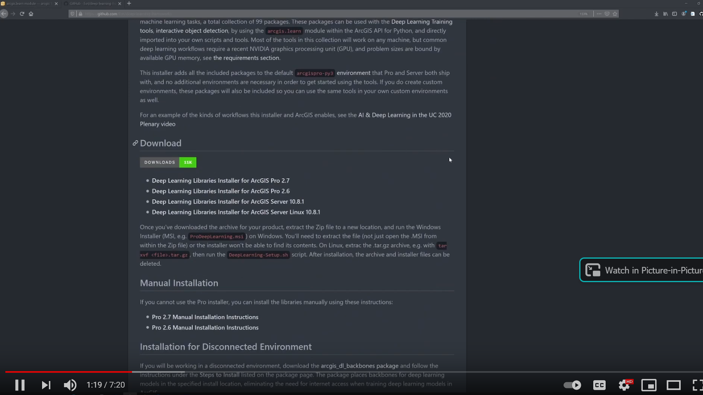

# Geospatial Deep Learning Examples

## Overview

The goal of this repo is to provides some examples for performing deep learning for **scene classification**, **semantic segmentation**, and **instance segmentation** applied to geospatial data using [fast.ai](https://www.fast.ai/) and the [arcgis.learn module](https://www.fast.ai/). Fast.ai allows for easier implementation of [PyTorch](https://pytorch.org/) while the arcgis.learn module makes use of fast.ai and makes it easier to prepare training data, train models on geospaital data, and predict back to and assess on spatial datasets. The documentation for these tools can be found here:

1. [arcgis.learn module v1.8.4](https://developers.arcgis.com/python/api-reference/arcgis.learn.toc.html#unetclassifier)
2. [Fast.ai v1](https://fastai1.fast.ai/)
3. [Fast.ai v2](https://docs.fast.ai/)

Note that the arcgis.learn module currently uses fast.ai v1. 

Example notebooks for implementing deep learning using the arcgis.learn module can be found [here](https://developers.arcgis.com/python/sample-notebooks/land-cover-classification-using-sparse-training-data/). A book on fast.ai is avaialble [here](https://github.com/fastai/fastbook).

## Getting Set-Up

For simplicity, all examples will assume you are using a Python environment installed along with ArcGIS Pro. Deep learning tools are not available by default in the Python environment that installs with ArcGIS Pro. However, the environment can be updated to provide this functionality. This process is explained at [this](https://github.com/Esri/deep-learning-frameworks/blob/master/README.md?rmedium=links_esri_com_b_d&rsource=https%3A%2F%2Flinks.esri.com%2Fdeep-learning-framework-install) link and is demonstrated in the video below. This process works for ArcGIS Pro version 2.6 and greater. 

The video below provides offers an introduction to deep learning as applied to geospatial data. 

## Related Resources

Lecture modules associated with these examples are avaialble on the [WV View](http://www.wvview.org/) webpage as part of the remote sensing course class. Example datasets generated by us are available under [Research](http://www.wvview.org/research.html) on the West Virginia View webpage. Links to other datasets used in the examples will be provided in those specific examples. 

## Description of Examples

